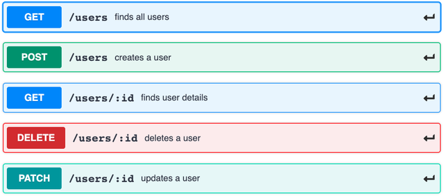

# NODE_EXPRESS_API

Build a REST API with Node JS and Express,
we will create a Node JS and Express JS CRUD REST API.



## Installation

1. Clone the repository:

   ```bash
   git clone https://github.com/Abdallah-Mobarak/NODE_EXPRESS_API.git
   ```

2. Navigate to the project directory:

   ```bash
   cd NODE_EXPRESS_API
   ```

3. Install dependencies:

   ```bash
   npm install
   ```

## Usage

1. Start the server:

   ```bash
   npm start
   ```

2. Access the application in your browser or API testing tool at:

   ```
   http://localhost:3000
   ```

## Project Structure

- **controllers/**: Contains controllers that handle application logic.
- **routes/**: Defines routes to map requests to the appropriate controllers.
- **index.js**: The main file to start the server.
- **package.json**: Includes project metadata and dependencies.
- **user.json**: Include mock data and user-related test data.

## Contribution

Contributions are welcome! Please follow these steps to contribute:

1. Fork the repository.
2. Create a new branch (`git checkout -b feature-name`).
3. Commit your changes (`git commit -m 'Add new feature'`).
4. Push to the branch (`git push origin feature-name`).
5. Open a pull request.

